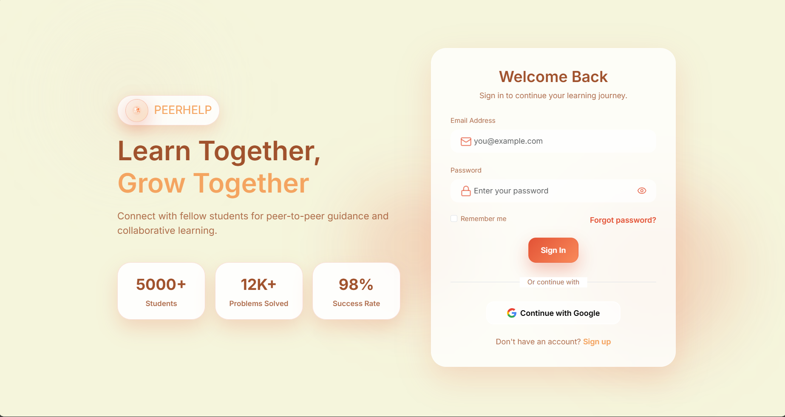
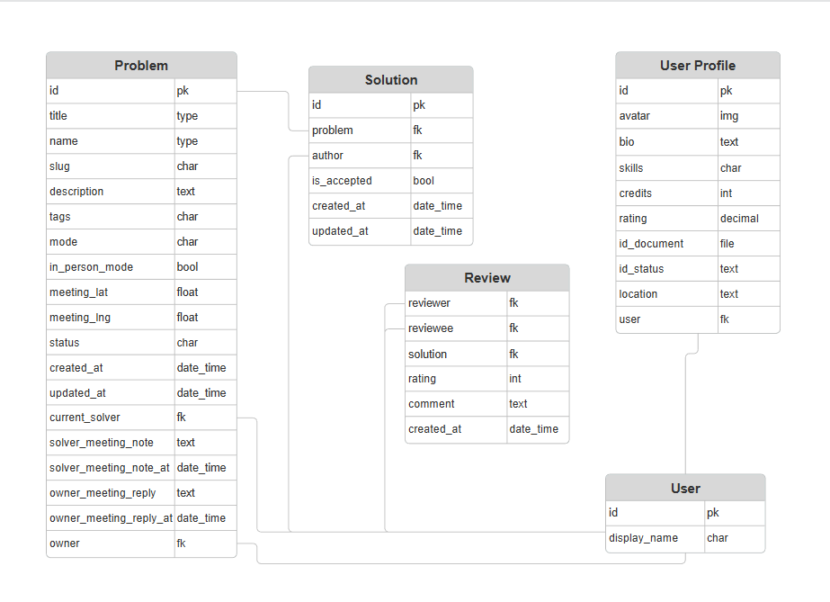
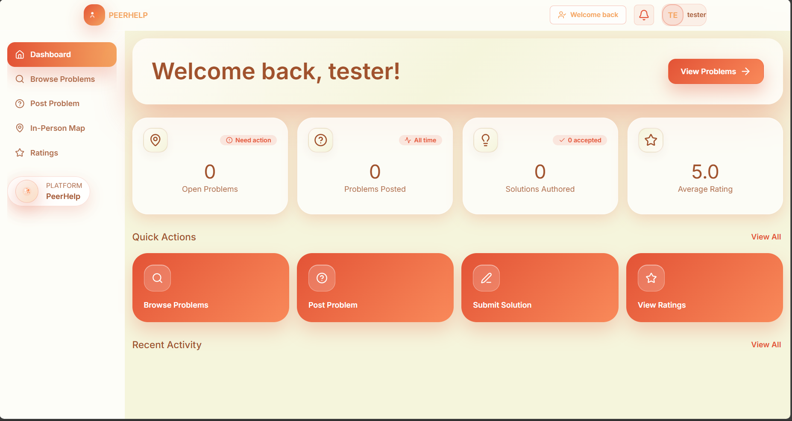
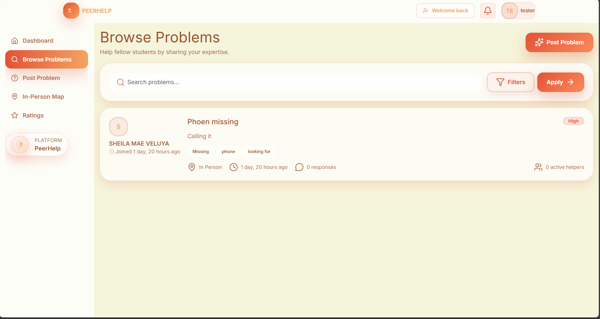
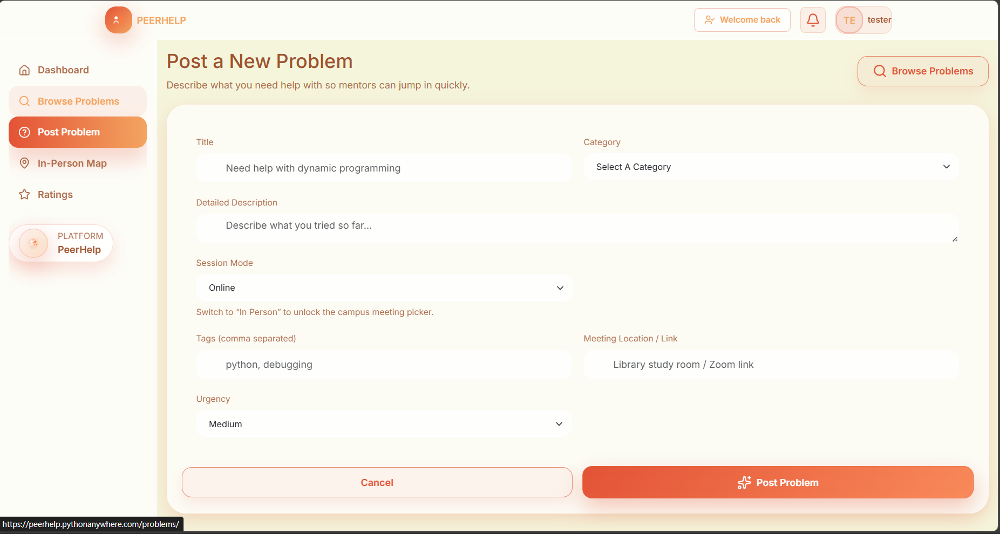
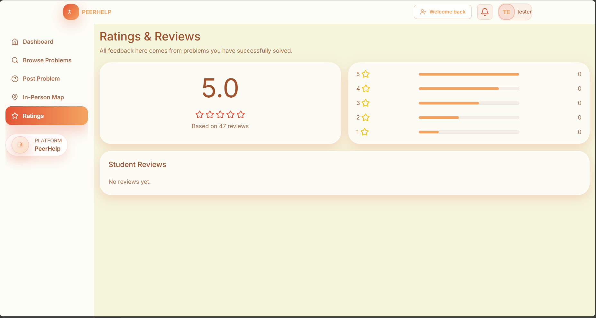
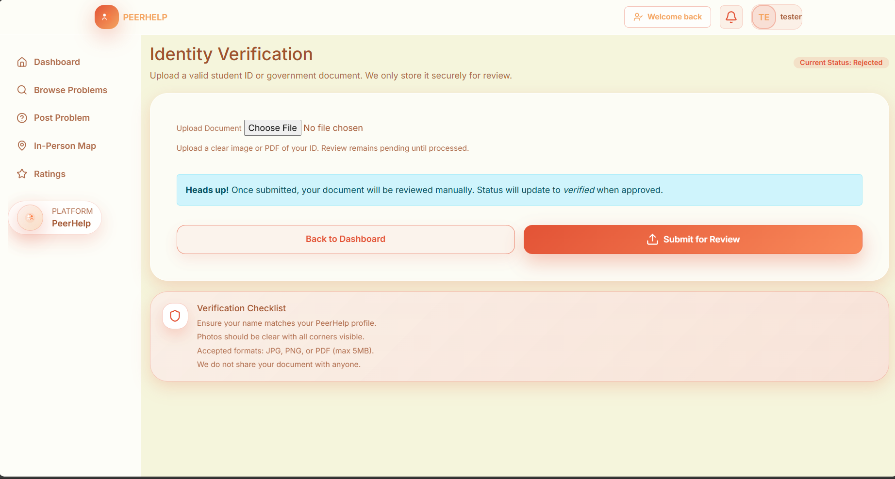
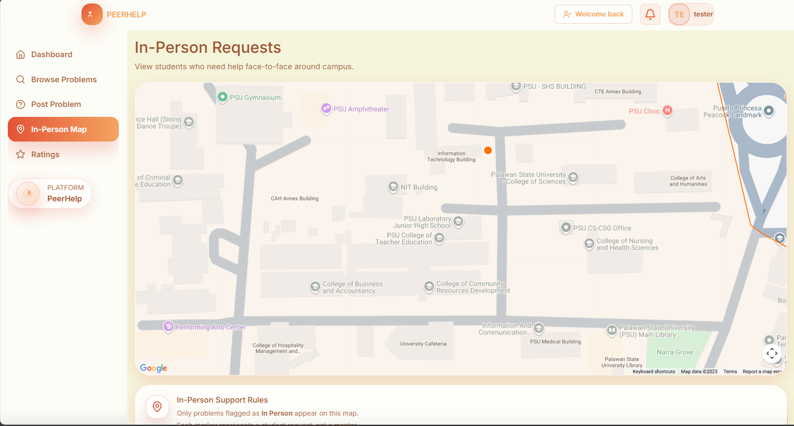

# Project PeerHelp



> A peer-to-peer academic web platform where students across different majors collaborate to solve problems, enhanced by Optical Character Recognition for student verification and location-based matching for face-to-face help.

A **Django Framework** Web Application Project written by ***SSSERScode*** Group for Application Development and Emerging Technologies Course.

[Canva Design](https://www.canva.com/design/DAG6I8siu0I/ofWUcVor5H6LA_FzI7kvKg/view?utm_content=DAG6I8siu0I&utm_campaign=designshare&utm_medium=link2&utm_source=uniquelinks&utlId=h83ed7f2d75)

### Database Design
- - -



###### Entity Relationship Diagram


### Features and Functionalities
- - -

****Dashboard****  
   

****Browse Problems****
   

****Posting New Problems****
   

****Problem Details****
   

****User Profile****
   

****Rating****
   

****Verification****
  

****Maps****
   

### Installation
1. **Clone & enter the project**
   ```bash
   git clone https://github.com/<your-org>/PeerHelp.git
   cd PeerHelp
   ```
2. **Create & activate a virtual environment**
   ```bash
   python -m venv peerhelp_env
   peerhelp_env\Scripts\activate
   ```
3. **Install dependencies**
   ```bash
   pip install -r requirements.txt
   ```
4. **Configure environment**
   - Copy `.env.example` to `.env`.
   - Fill in `SECRET_KEY`, database settings, Google/OCR keys, etc.
5. **Apply migrations to initialize database**
   ```bash
   python manage.py makemigration
   python manage.py migrate
   ```
6. **Run the development server**
   ```bash
   python manage.py runserver
   open with browser http://127.0.0.1:8000/
   ```
   
#### APIs:

- **Google Maps API**

This project utilize [Google Maps API](https://developers.google.com/maps/) for face-to-face help and showing the local map of Palawan State University for easier problem solving collaborations.

- **Google OAuth**

Using [Google OAuth](https://developers.google.com/identity/protocols/oauth2) for security and ease of registration and login using Google accounts.

- **OCR.space API**

[OCR.space API](https://ocr.space/OCRAPI) for verification of Student ID using Optical Character Recognition to validate PSU Students via upload of School ID.


## Authors

#### SSSERScode Group

**Project Designers:** [Samir](https://github.com/xamzzs),
[Scott](https://github.com/Iskatiboi)

**Main Developers:** [Samir](https://github.com/xamzzs), [Ralph](https://github.com/YG-paaleee)

**UI/UX Design:** [Samir](https://github.com/xamzzs), [Ralph](https://github.com/YG-paaleee), Michael Yap

**Graphic Designer:** [Earl](https://github.com/Erlybird21), [Scott](https://github.com/Iskatiboi), [Shiela](https://github.com/Shirajuana), [Rossvelt](https://github.com/RRA1010)

**Documentation:** [Rossvelt](https://github.com/RRA1010)